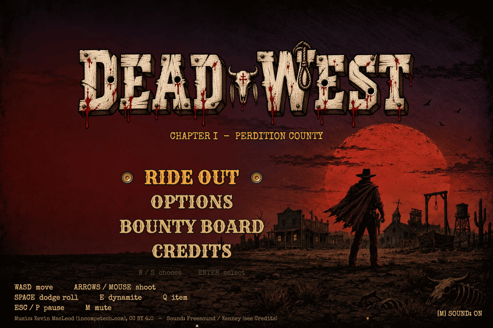
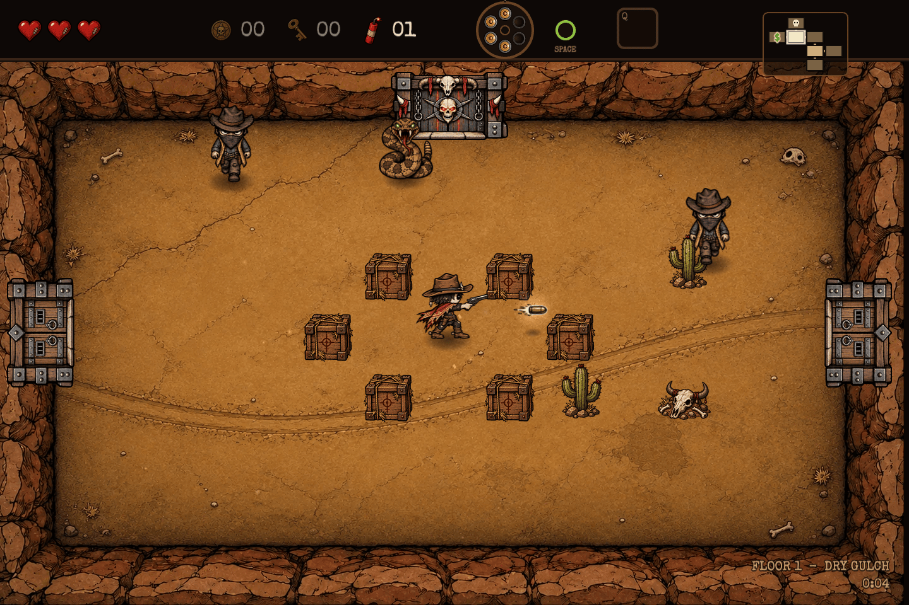
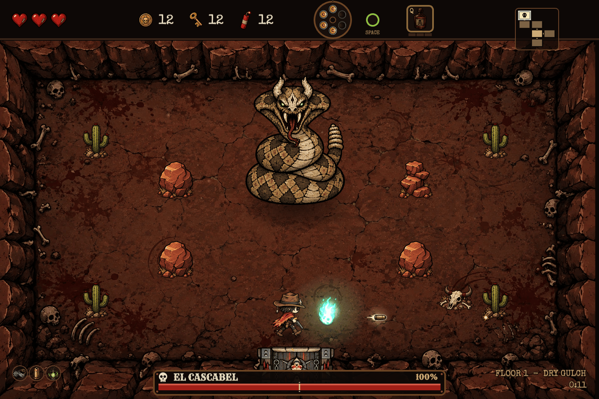

# DEAD WEST

A top-down twin-stick roguelike shooter in the vein of *The Binding of Isaac*, set in a dark occult western. You are a dead gunslinger dragged out of your grave by a debt signed in blood; shoot through Perdition County, floor by floor, to the saloon where the Devil keeps your contract.

**Chapter 1** (playable, complete): 3 procedurally generated floors (Dry Gulch, Perdition, Sundown Mine), 3 bosses (El Cascabel, Marshal Grimm, The Undertaker), 16 enemy types, 28 items (24 passives + 4 actives), 65 hand-authored room templates, shops, treasure rooms, secret rooms, permadeath.

Phaser 3.90 + Vite 7, vanilla JavaScript (ES modules), no TypeScript. Runs in the browser; ~18 MB built.





More screenshots in `art/screens/` (regenerate with `node tools/qa/screens.mjs`).

## Run it

Requires Node >= 20.19 (Vite 7) and a current Chrome / Firefox / Safari.

```bash
npm install
npm run dev        # http://127.0.0.1:5173  (hot reload)
npm run build      # production build -> dist/
npm run preview    # serve dist/ at http://127.0.0.1:4173
npm run zip        # dist/ -> dead-west-web.zip (index.html at the archive root; upload to itch.io as an HTML5 game)
```

`dist/` is self-contained and uses relative paths (`base: './'`), so it works from any folder of a web server. It must be served over HTTP (module scripts do not load from `file://`). The only external request is the Google Fonts stylesheet (Rye, Special Elite); the game falls back to Georgia/serif if it is blocked.

Cache busting: the JS bundles have content-hashed names; every sprite/image/audio URL carries `?v=<hash>` taken from `manifest.json`, which is fetched with `no-store`. Re-run `tools/build_manifest.py` after changing art/audio and updated files show up on the next visit.

## Controls

| Action | Keys |
|---|---|
| Move | W A S D |
| Shoot | Arrow keys (4-way, last pressed wins) or hold Left Mouse toward the cursor |
| Dodge roll | Space (brief i-frames, 1 s cooldown) |
| Place dynamite | E (1.4 s fuse, hurts you too; opens secret rooms and breakables) |
| Use active item | Q (needs a full charge) |
| Pause / options | Esc or P |
| Mute | M |
| Restart / menu (after death) | R or Enter / Esc |

Menu: W/S or arrows + Enter, or mouse.

## URL flags

| Flag | Effect |
|---|---|
| `?debug=1` | Debug overlay + keys: F1 next floor, F2 full heal, F3 random passive, F4 +99 coins/keys/dynamite, F5 kill all, F6 teleport to boss room, F7 god mode. Also exposes `window.__game` and `window.__dw.api` (spawn, giveItem, setFloor, teleport, killAll, state ...; see `docs/ARCHITECTURE.md`) |
| `?seed=N` | Deterministic run (same floors, same drops) |
| `?noassets=1` | Ignore the manifest: everything is a generated placeholder (proves the game runs with no art/audio) |
| `?dropassets=N` | Randomly drop ~N % of manifest entries (tests missing-asset paths) |
| `?selftest=1` | Validate all templates and 100 seeds of floor generation, result in the console |

Flags combine: `http://127.0.0.1:5173/?debug=1&seed=42`.

## npm scripts

| Script | What it does |
|---|---|
| `dev`, `build`, `preview` | Vite dev server / production build / preview of `dist/` |
| `zip` | Build if needed, then zip `dist/` to `dead-west-web.zip` (system `zip` binary) |
| `smoke` | Headless Chrome: boot -> menu -> start run -> move -> screenshot, prints fps + console errors |
| `selftest` | Node: validates every room template and 300 seeds of floor generation |
| `test:floorgen` | Node: deeper floor-graph invariants (`node tools/floorgen-test.mjs [seeds]`) |
| `test:prod` | Builds if needed, serves `dist/` via `vite preview` **and** from a nested folder, plays menu -> run -> all 3 bosses -> death in headless Chrome, checks cache-busters and that no dev-only files ship |

## Project structure

```
index.html            page shell (fonts, click-to-focus overlay)
vite.config.js        base './', phaser vendor chunk, strips dev-only files from dist/assets
src/
  main.js config.js   Phaser boot; ALL tunables (sizes, stats, floor gen, enemy defaults, rewards)
  core/               rng, event bus, assets/manifest, audio (mixer, director, lazy loader), input, save, debug API
  gen/                floor generator, ASCII room templates (65), template validator, selftest
  rooms/ entities/    Room + RoomManager + Door; Player, Pickup, Pedestal, Chest, Dynamite, Shop, Trapdoor
  enemies/ bosses/    registry + base class + one file per type (auto-registered via import.meta.glob)
  items/ systems/     28 item defs, familiars, bullet-time; bullets, explosions, fx
  scenes/ ui/         Boot, Menu, Game, HUD, Pause, End scenes; HUD widgets and menu kit
public/assets/        sprites/ images/ audio/ + manifest.json (generated), CREDITS_*.md
docs/                 GAME_DESIGN.md (intent), ARCHITECTURE.md (APIs, how-tos, QA), ART_BIBLE.md, ASSET_SPEC.md
tools/                asset pipeline (python), floorgen test, zip script, qa/ (headless-Chrome harness + reusable scripts)
art/                  art sources: prompts/ raw/ originals/ style/ concepts/ screens/ (curated screenshots)
```

## Art

All visuals were generated with **GPT Image 2.5 through Codex** (the `gpt-image` skill), in one dark ink-cartoon / woodcut style anchored on `art/style/style_c.png` (see `docs/ART_BIBLE.md`). Pipeline:

1. Prompt (`art/prompts/<key>.txt`, style boilerplate from the art bible + style reference image) -> raw output in `art/raw/<key>.png` (`.raw.png` = untouched, `.log`/`.out` = generation logs).
2. `tools/sprites.py` slices strips/grids/single images, applies one scale factor per sheet, registers frames on centroid-x / ground line, downsamples, and writes `public/assets/sprites|images/<key>.png` (+ `.meta.json`, `.preview.png`).
3. `tools/optimize_assets.py` shrinks for load time (big opaque backgrounds -> WebP q90, other PNGs -> pngquant palette PNG, music -> 96 kbps mp3); originals are kept in `art/originals/`.
4. `tools/build_manifest.py` rebuilds `public/assets/manifest.json` (frame data, files, licences, content-hash `version`).

Regenerating an asset:

```bash
python3 -m venv .venv-art && .venv-art/bin/pip install -r tools/requirements.txt   # once; also needs ffmpeg + pngquant (brew install ffmpeg pngquant)
# 1. generate a new raw image from art/prompts/<key>.txt with gpt-image, save as art/raw/<key>.png
.venv-art/bin/python tools/sprites.py strip art/raw/enemy_coyote.png public/assets/sprites/enemy_coyote.png --frames 6 --fw 128 --fh 128 --key enemy_coyote
.venv-art/bin/python tools/optimize_assets.py      # idempotent
.venv-art/bin/python tools/build_manifest.py       # bumps the ?v= cache-buster
```

Frame sizes and keys are the contract in `docs/ASSET_SPEC.md`; the game runs with any subset present (missing key -> coded placeholder). `art/raw` (~240 MB incl. 17 MB `tmp/`, which is git-ignored) and `art/prompts` are the source of truth for regeneration; `art/originals` (~46 MB) holds pre-optimisation files.

## Audio and licensing

Music: nine Kevin MacLeod (incompetech.com) tracks, **CC BY 4.0** (attribution is required; it is shown on the menu and in the in-game credits). SFX: mostly CC0 (Freesound, Kenney) plus in-project synthesised sounds. Every source is logged in `public/assets/audio/CREDITS_music.md` and `CREDITS_sfx.md` (both ship in `dist/`), and per key in `manifest.json`. `tools/measure_audio.py` writes the loudness table `src/core/mixLevels.js`.

**Licensing is NOT cleared for a commercial release.** Entries flagged by the audio engineer that must be replaced or cleared first:

| Key | Source (Freesound) | License | Problem |
|---|---|---|---|
| `snake_rattle` | fstagi #405391 | CC BY-NC 3.0 | non-commercial only: replace for any paid/monetised release |
| `shoot_3` | Rock Savage #58904 | Sampling+ 1.0 | not a permissive licence (no advertising/derivative-in-ads use): replace or clear |
| `bat_screech_2` | richcraftstudios #770720 | CC BY 4.0 | needs attribution |
| `boss_intro_2` | MeijstroAudio #377303 | CC BY 4.0 (layered with a synth) | needs attribution |
| `shoot_crit` | eardeer #402004 (layer) | CC BY 4.0 (other layer CC0) | needs attribution |
| `coyote_howl_3` | rogerforeman #68068 | CC BY 3.0 | needs attribution |
| `mus_*` (9 tracks) | Kevin MacLeod | CC BY 4.0 | needs attribution (already in menu/credits) |

Before release: swap the NC / Sampling+ files, and add the CC BY SFX authors to the in-game credits (`src/scenes/MenuScene.js`, `CREDITS` array; currently only the music credit and "Freesound / Kenney" are shown).

## QA harness

`tools/qa/harness.mjs` drives headless Chrome (puppeteer-core + system Chrome; override with `QA_CHROME`). Each `launch()` starts its own private Vite server (HMR off, so parallel edits cannot reload the page); pass `baseUrl` to test a built/preview server instead.

```js
import { launch } from './tools/qa/harness.mjs';
const g = await launch({ query: '?debug=1&seed=42' });
await g.startRun();
await g.eval(() => window.__dw.api.spawn('coyote', 700, 500));
await g.hold('KeyD', 500); await g.shot('demo');   // -> art/qa/demo.png (git-ignored)
console.log(g.errors); await g.close();
```

Reusable scripts in `tools/qa/` (run from the project root, one Chrome at a time):

| Script | Purpose |
|---|---|
| `smoke.mjs` | boot + start + fps + console errors (`npm run smoke`) |
| `prod-check.mjs` | production build end-to-end (`npm run test:prod`) |
| `fuzz-run.mjs [sim-s] [seed]` | seeded random play in fast-forward with random teleports/spawns/items/deaths; fails on errors or broken invariants |
| `bot.mjs`, `bot-report.mjs` | autoplay bot (god mode off) over many seeds / skill levels, JSONL results + summary table (`--seeds 1-8 --skill expert`): balance and difficulty checks |
| `rb-fuzz.mjs` | robustness fuzz: random inputs, abused debug API, pause/blur mashing |
| `spec-*.mjs` | checks of every `GAME_DESIGN.md` feature and number; results in `docs/QA_SPEC_AUDIT.md` |
| `boss-cascabel-bot.mjs`, `boss-grimm-bot.mjs`, `boss-undertaker-bot.mjs` | dodging bot fights vs each boss (god mode off) |
| `stress-enemies.mjs [floor] [ids]`, `stress-items.mjs` | 60 s enemy pack soak (leaks/fps) / every item x3 + combat + boss + death restart |
| `regress-items.mjs`, `regress-levels.mjs`, `regress-audio.mjs`, `regress-ui.mjs` | PASS/FAIL behaviour checks per area (items, wave flow, audio mixer, menus/pause/death) |
| `screens.mjs` | regenerates the curated screenshots in `art/screens/` |
| `contact-sheet.py` | tile screenshots into one image (`.venv-art/bin/python tools/qa/contact-sheet.py out.png 4 480 shots...`) |

Notes: headless Chrome renders ~30 fps at 1440x960 (software GL), so long scenarios use fast-forward (`game.step` with rendering hidden). Phaser tweens run on wall-clock time, so door slides and cutscenes only finish while the game loop is awake (see `fuzz-run.mjs`).

## Docs

`docs/GAME_DESIGN.md` (design intent) - `docs/STATUS.md` (what is done, known issues, next steps, Chapter 2 ideas) - `docs/ARCHITECTURE.md` (code map, APIs, how to add enemies/bosses/items/rooms, audio/loading pipeline, QA, status and known issues) - `docs/QA_SPEC_AUDIT.md` (feature-by-feature check against the design) - `docs/ART_BIBLE.md` - `docs/ASSET_SPEC.md`.
